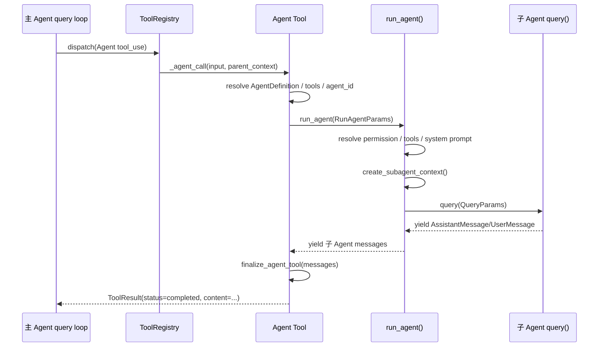

# 子 Agent 管理解析

> [!summary]
> 当前代码里的“子 Agent”主要不是独立 OS 进程，而是由主 Agent 通过 `Agent` 工具在同一 Python 进程中启动的一套嵌套 query loop。它拥有独立的 `ToolContext`、独立消息列表和独立工具过滤结果；同步模式会阻塞主 Agent 等待结果，后台模式目前只返回 `agent_id`，缺少完整的结果登记和 `SendMessage` 恢复链路。

## 目录

- [[#1. 总体结论]]
- [[#2. 关键代码地图]]
- [[#3. 子 Agent 是什么时候创建的]]
- [[#4. 创建入口：Agent Tool]]
- [[#5. Agent 类型与路由机制]]
- [[#6. 生命周期]]
- [[#7. 子 Agent 继承了什么]]
- [[#8. 子 Agent 隔离了什么]]
- [[#9. 权限继承与权限提示]]
- [[#10. 工具继承与工具过滤]]
- [[#11. 消息传递机制]]
- [[#12. 进程关系与 IPC]]
- [[#13. 销毁与清理机制]]
- [[#14. 后台 Agent 当前状态]]
- [[#15. Swarm/Teammate 旁路]]
- [[#16. 重要边界与风险]]

## 1. 总体结论

当前子 Agent 系统的核心链路是：

```text
主 Agent 模型输出 Agent tool_use
  -> query.py 执行工具
  -> ToolRegistry.dispatch("Agent")
  -> make_agent_tool()._agent_call()
  -> 构造 RunAgentParams
  -> run_agent()
  -> create_subagent_context()
  -> 子 Agent 调用 query()
  -> 子 Agent 消息流被收集
  -> finalize_agent_tool()
  -> 返回一个 Agent 工具结果给主 Agent
```

核心性质：

- 子 Agent 与主 Agent **同进程**。
- 子 Agent 不共享主 Agent 的完整 conversation history，默认只收到调用方传入的 `prompt`。
- 子 Agent 有自己的 system prompt、tool list、permission context、abort controller 和 query source。
- 同步子 Agent 执行结束后，最终结果被包装成主 Agent 的 `tool_result`。
- 当前没有真正完整实现“后台 Agent 管理池 + SendMessage 继续通信”。
- `services/swarm` 是另一套轻量 teammate 管理器，目前没有接入 `Agent` 工具主链路。

## 2. 关键代码地图

| 模块 | 作用 |
|---|---|
| `src/tool_system/tools/agent.py` | 定义 `Agent` 工具，负责解析输入、选择 agent definition、启动同步或后台子 Agent。 |
| `src/agent/run_agent.py` | 子 Agent 生命周期核心：解析权限、工具、system prompt、创建子上下文、运行 query loop、清理。 |
| `src/agent/subagent_context.py` | 从父 `ToolContext` 创建隔离的子 `ToolContext`。 |
| `src/agent/agent_definitions.py` | 内置 Agent 定义：`general-purpose`、`Explore`、`Plan`。 |
| `src/agent/agent_tool_utils.py` | 工具过滤、工具解析、统计 tool_use、提取最终结果。 |
| `src/agent/prompt.py` | 生成 `Agent` 工具描述，以及子 Agent system prompt。 |
| `src/tool_system/defaults.py` | 默认工具注册时注册 `Agent` 工具。 |
| `src/query/query.py` | 主/子 Agent 共用的 query loop；执行工具调用并产出消息。 |
| `src/command_system/input_processing.py` | 处理 `@agent-xxx` mention，向模型注入“请调用 Agent 工具”的提醒。 |
| `src/services/swarm/*` | 轻量 teammate 管理器，当前是旁路子系统。 |

## 3. 子 Agent 是什么时候创建的

子 Agent 只在 `Agent` 工具被实际执行时创建。

触发方式有两类：

### 3.1 模型主动调用 Agent 工具

主 Agent 的模型返回 `tool_use`，其中工具名为 `Agent`：

```json
{
  "type": "tool_use",
  "name": "Agent",
  "input": {
    "description": "...",
    "prompt": "...",
    "subagent_type": "Explore"
  }
}
```

随后 `src/query/query.py` 的 `_run_tools_partitioned()` 调用 `_dispatch_single_tool()`，最终进入：

```python
tool_registry.dispatch(call, tool_use_context)
```

`ToolRegistry` 找到 `Agent` 工具后执行 `make_agent_tool()._agent_call()`。

### 3.2 用户输入 `@agent-...` 间接触发

REPL 在 `SocratesREPL.chat()` 里调用：

```python
expand_agent_mentions(user_input, self._available_agents())
```

它支持：

- `@agent-Explore`
- `@"Explore (agent)"`

如果 mention 命中已知 agent type，会在用户消息前面插入一个 `<system-reminder>`：

```text
The user has expressed a desire to invoke the agent "Explore".
Please invoke the agent appropriately using the Agent tool...
```

注意：这只是提醒模型调用 `Agent` 工具，不是 REPL 直接创建子 Agent。真正创建仍发生在模型输出 `Agent` tool_use 后。

## 4. 创建入口：Agent Tool

`Agent` 工具由 `build_default_registry()` 注册：

```python
registry.register(make_agent_tool(registry, provider=provider))
```

`Agent` 工具输入 schema 主要字段：

| 字段 | 必填 | 含义 |
|---|---:|---|
| `description` | 是 | 3-5 个词的任务摘要。 |
| `prompt` | 是 | 交给子 Agent 的完整任务描述。 |
| `subagent_type` | 否 | 指定 Agent 类型；不填时默认 `general-purpose`。 |
| `model` | 否 | 声称支持模型覆盖，但当前 `run_agent()` 未真正用它切换 provider/model。 |
| `run_in_background` | 否 | 为 true 时走后台模式。 |
| `isolation` | 否 | schema 支持 `"worktree"`，但当前 `_agent_call()` 没消费该字段。 |

`_agent_call()` 的创建动作：

1. 校验 `prompt`。
2. 解析 `description`、`subagent_type`、`model`、`run_in_background`。
3. 找到对应 `AgentDefinition`。
4. 从 registry 获取当前可用工具列表。
5. 生成 `agent_id = uuid4().hex`。
6. 构造 `RunAgentParams`。
7. 根据 `run_in_background` 选择同步或后台路径。

## 5. Agent 类型与路由机制

### 5.1 内置 Agent

当前 `get_built_in_agents()` 返回三个内置类型：

| agent_type | 定位 | 工具策略 |
|---|---|---|
| `general-purpose` | 通用搜索、研究、多步任务 | `tools=["*"]`，经过全局过滤后可用。 |
| `Explore` | 只读代码探索 | 禁用 `Agent`、`ExitPlanMode`、`Edit`、`Write`、`NotebookEdit`。 |
| `Plan` | 只读架构规划 | 禁用 `Agent`、`ExitPlanMode`、`Edit`、`Write`、`NotebookEdit`，`model="inherit"`。 |

文件里还有 `FORK_AGENT` 定义，但 `get_built_in_agents()` 没返回它；当前常规路由不会选到 `fork`。

### 5.2 选择规则

`_agent_call()` 的选择规则：

```python
if subagent_type:
    agent_def = find_agent_by_type(agent_definitions, subagent_type)
else:
    agent_def = find_agent_by_type(agent_definitions, "general-purpose") or agent_definitions[0]
```

如果指定了未知 `subagent_type`，直接抛 `ToolInputError`，并列出可用 agent types。

### 5.3 Agent definitions 来源

`Agent` 工具优先从：

```python
context.options.agent_definitions["active_agents"]
```

读取 active agents；没有时退回内置 agent。

而 REPL 的 `@agent` mention 可用列表来自：

```python
get_built_in_agents() + tool_context.options.agent_definitions
```

这里有一个细节：`Agent` 工具读取的是 `active_agents` key；REPL `_available_agents()` 会把 `agent_definitions` 的 values 或 list 合并进去。两者对自定义 agent definitions 的结构预期不完全一致。

### 5.4 模型路由现状

代码里存在两套模型路由辅助：

- `src/models/agent_routing.py::get_model_for_agent()`
- `src/services/api/provider_config.py::resolve_agent_provider()`

但当前 `Agent` 工具主链路没有调用它们。

`Agent` 工具 schema 有 `model` 字段，`AgentDefinition` 也有 `model` 字段，`RunAgentParams` 也带 `model`，但 `run_agent()` 构造 `QueryParams` 时只传入 `provider=params.provider`，没有按 `params.model` 创建新 provider 或切换 model。因此当前实际行为基本是：**子 Agent 复用父 Agent 的 provider/model**。

## 6. 生命周期

### 6.1 同步子 Agent 生命周期



同步模式下，主 Agent 会等待子 Agent 完成。实现上：

- 如果当前线程已有 running event loop，则用 `ThreadPoolExecutor(max_workers=1)` 在新线程里 `asyncio.run()`。
- 如果没有 running loop，则当前 loop `run_until_complete()` 或 `asyncio.run()`。

### 6.2 后台子 Agent 生命周期

当 `run_in_background=true`：

```python
return _launch_async_agent(...)
```

返回给主 Agent 的工具结果是：

```json
{
  "status": "async_launched",
  "agent_id": "...",
  "agent_type": "...",
  "description": "..."
}
```

设计意图是“后台运行，稍后通知或继续通信”。但当前实现有明显缺口：

- 没有全局 agent registry 保存后台 agent 的 messages/result。
- 没有实现 `SendMessage` 工具。
- prompt 文案提到 `SendMessage`，但测试里也标注 `SendMessage` 尚未实现。
- 如果 `_launch_async_agent()` 在没有 running event loop 的线程里执行，它会 `new_event_loop()` 并 `create_task()`，但没有启动该 loop，因此任务可能不会真正运行。
- 即使在 running loop 下成功调度，完成后也只是写 logger，没有把结果送回主会话。

所以当前后台 Agent 更像半成品接口。

### 6.3 子 Agent 内部 query 生命周期

`run_agent()` 复用主 Agent 的 `query()`：

```python
query_params = QueryParams(
    messages=initial_messages,
    system_prompt=system_prompt,
    tools=agent_tools,
    tool_registry=params.tool_registry,
    tool_use_context=subagent_context,
    provider=params.provider,
    abort_controller=abort_controller,
    query_source=f"agent_{agent_def.agent_type}",
    max_turns=max_turns,
)
```

关键点：

- 子 Agent query source 是 `agent_<agent_type>`。
- 子 Agent 默认最大轮数是 `SUBAGENT_DEFAULT_MAX_TURNS = 30`，除非 `AgentDefinition.max_turns` 或 `RunAgentParams.max_turns` 指定。
- 子 Agent 不传 `pipeline_config`，代码注释说明子 Agent 不走主 REPL 的 aggressive compression pipeline。

## 7. 子 Agent 继承了什么

子 Agent 通过 `create_subagent_context(parent_context, overrides)` 从父 `ToolContext` 派生。

### 7.1 直接继承或共享的数据

| 字段 | 子 Agent 行为 |
|---|---|
| `workspace_root` | 继承父上下文。 |
| `cwd` | 继承父上下文。 |
| `task_manager` | 共享父对象。 |
| `mcp_clients` | 共享父对象。 |
| `lsp_client` | 共享父对象。 |
| `team` | 继承父上下文。 |
| `output_style_name` / `output_style_dir` | 继承。 |
| `additional_working_directories` | 继承。 |
| `allow_docs` | 继承。 |
| `options` | 默认共享父 `ToolUseOptions`。 |
| `file_reading_limits` / `glob_limits` | 继承同一对象。 |
| `user_modified` | 继承当前值。 |
| `content_replacement_state` | 默认 deep copy，不是同一引用。 |

### 7.2 通过 overrides 注入的数据

`run_agent()` 创建 overrides：

```python
SubagentContextOverrides(
    agent_id=agent_id,
    agent_type=agent_def.agent_type,
    messages=params.context_messages or [],
    abort_controller=abort_controller,
    permission_context=perm_context,
    share_abort_controller=not params.is_async,
    share_set_response_length=not params.is_async,
    share_permission_handler=not params.is_async,
)
```

因此正常 Agent 工具启动的子 Agent：

- 有明确 `agent_id`。
- 有明确 `agent_type`。
- `messages` 默认是空列表，除非外部显式传 `context_messages`。
- 同步子 Agent 会共享 permission handler 和 set_response_length。
- 后台子 Agent 不共享 permission handler 和 set_response_length。

### 7.3 初始消息继承情况

子 Agent 的初始消息是：

```python
initial_messages = list(subagent_context.messages) + [UserMessage(content=params.prompt)]
```

在 `Agent` 工具常规路径里，`context_messages` 没有传，所以：

```text
initial_messages = [UserMessage(content=Agent工具input.prompt)]
```

也就是说，子 Agent 默认不会自动继承主对话完整历史。父 Agent 必须把必要上下文写进 `prompt`。

这和 `Agent` 工具 prompt 文案一致：它提醒主 Agent 要像给一个没看过上下文的同事交代任务。

## 8. 子 Agent 隔离了什么

`create_subagent_context()` 明确隔离一批可变状态：

| 字段 | 子 Agent 默认值 | 目的 |
|---|---|---|
| `read_file_fingerprints` | `{}` | 子 Agent 没读过父 Agent 读过的文件，避免 Read 工具误判 `file_unchanged`。 |
| `todos` | `[]` | 子 Agent TODO 不污染父 Agent。 |
| `tasks` | `{}` | 子 Agent task 状态隔离。 |
| `outbox` | `[]` | 输出队列隔离。 |
| `crons` | `{}` | 定时任务隔离。 |
| `ask_user` | `None` | 默认不让子 Agent 直接询问用户。 |
| `set_in_progress_tool_use_ids` | `None` | 不更新父 UI 的 in-progress tool ids。 |
| `permission_handler` | 默认 `None`，同步 Agent override 共享 | 后台模式避免弹交互权限。 |
| `set_response_length` | 默认 `None`，同步 Agent override 共享 | 后台模式不改父响应长度。 |
| `query_tracking` | 新 chain_id，depth+1 | 记录嵌套深度。 |

测试 `tests/test_subagent_context.py` 覆盖了这些隔离行为。

## 9. 权限继承与权限提示

权限解析在 `run_agent.py::resolve_permission_mode()`。

规则：

1. 如果父上下文是 `bypassPermissions`、`acceptEdits`、`dontAsk`，父模式优先。
2. 如果父上下文是 `plan` 或 `default`，且 agent definition 指定 `permission_mode`，则 agent 覆盖。
3. 否则继承父模式。

`_build_permission_context()` 会继承父上下文的：

- `additional_working_directories`
- `always_allow_rules`
- `always_deny_rules`
- `always_ask_rules`
- `is_bypass_permissions_mode_available`

后台 Agent 会强制：

```python
should_avoid_permission_prompts=True
```

同步 Agent 则保留父上下文的 `should_avoid_permission_prompts`。

随后 `create_subagent_context()` 里还会根据是否共享 abort controller 决定是否复用父 permission context；但在 `run_agent()` 常规路径中已经显式传入 `permission_context=perm_context`，所以以 `_build_permission_context()` 的结果为准。

## 10. 工具继承与工具过滤

子 Agent 的可用工具来自父 registry 当前可用工具：

```python
available_tools = registry.list_tools()
```

然后通过：

```python
resolve_agent_tools(agent_def, available_tools, is_async=params.is_async)
```

过滤。

### 10.1 全局禁用工具

所有 Agent 都禁用：

```text
TaskOutput
ExitPlanMode
EnterPlanMode
Agent
AskUserQuestion
TaskStop
Brief
```

例外：如果 agent 的 `permission_mode == "plan"`，`ExitPlanMode` 会被允许。

`Agent` 被禁用意味着当前子 Agent 默认不能继续创建孙 Agent。

### 10.2 MCP 工具

MCP 工具特殊处理：

- `tool.name.startswith("mcp__")`
- 或 `tool.is_mcp`

会直接允许进入子 Agent 工具池，不受普通过滤影响。

### 10.3 Async Agent 工具白名单

后台 Agent 只允许：

```text
Read
WebSearch
TodoWrite
Grep
WebFetch
Glob
Bash
Edit
Write
Skill
StructuredOutput
EnterWorktree
ExitWorktree
```

但 MCP 工具仍然允许。

### 10.4 Agent 自身 allowlist/denylist

如果 `AgentDefinition.tools is None` 或 `["*"]`，则代表“所有过滤后工具”。

如果 `AgentDefinition.disallowed_tools` 存在，会从工具池里继续剔除这些工具。

`Explore` 和 `Plan` 都通过 `disallowed_tools` 做只读约束。

## 11. 消息传递机制

### 11.1 主 Agent 到子 Agent

主 Agent 传给子 Agent 的主要消息只有一个：

```python
UserMessage(content=params.prompt)
```

如果 `context_messages` 显式传入，则会放在 prompt 前面。但当前 `Agent` 工具路径没有填 `context_messages`。

所以主 Agent 到子 Agent 的通信不是共享历史，而是通过 `Agent` 工具 input 的 `prompt` 字段“一次性交付任务”。

### 11.2 子 Agent 内部消息流

子 Agent 运行 `query()` 后，会 yield：

- `AssistantMessage`
- `UserMessage`，主要是工具结果
- `SystemMessage`
- `StreamEvent`

`run_agent()` 会跳过 `StreamEvent`，把其他消息 append 到 `agent_messages` 并继续 yield。

`_collect_agent_messages()` 会收集所有消息；遇到 assistant 文本或 tool_use，会向 `stderr` 打印简短进度：

```text
  ⎿ [Explore] ...
  ⎿ [Explore] Read(...)
```

这只是 UI/终端进度反馈，不是主 Agent 可读的结构化消息。

### 11.3 子 Agent 到主 Agent

同步模式结束后：

```python
finalize_agent_tool(agent_messages, agent_id, metadata)
```

它从最后一个 assistant message 里提取文本 block。如果最后一条没有文本，则向前查找最近的 assistant 文本。

返回给主 Agent 的工具输出结构：

```json
{
  "status": "completed",
  "agent_id": "...",
  "agent_type": "...",
  "content": [
    {"type": "text", "text": "..."}
  ],
  "total_duration_ms": 1234,
  "total_tokens": 0,
  "total_tool_use_count": 3
}
```

然后 `Agent` 工具的 `_map_result_to_api()` 把这个输出映射成主 Agent 历史里的 `tool_result`：

```json
{
  "type": "tool_result",
  "tool_use_id": "...",
  "content": [
    {"type": "text", "text": "..."}
  ]
}
```

也就是说，主 Agent 看到的是“Agent 工具结果”，不是子 Agent 的完整 transcript。

### 11.4 子 Agent 工具结果不暴露给父用户消息

在 `services/tool_execution/tool_execution.py` 里，如果 `tool_use_context.agent_id` 存在：

```python
toolUseResult=result.data if not tool_use_context.agent_id else None
```

这表示子 Agent 内部工具调用不会把完整 `toolUseResult` 附到消息上给外层 UI 使用，避免把子 Agent 内部工具结果直接暴露成父上下文的富结果。

## 12. 进程关系与 IPC

当前 `Agent` 工具文案里写了 “subprocesses”，但从 Python 实现看：

- 没有 `subprocess.Popen` 创建子 Agent 进程。
- 没有 socket、pipe、queue、RPC 作为主/子 Agent IPC。
- 同步 Agent 是函数调用 + asyncio generator。
- 当已有 event loop 时，同步 Agent 会用 `ThreadPoolExecutor` 开一个线程跑新的 event loop，这仍然是同一 Python 进程内线程，不是独立进程。

因此“进程间消息传递机制”的准确结论是：

> 当前子 Agent 与主 Agent 之间没有进程间通信。它们通过同进程内的 Python 对象、函数调用、async generator yield、`ToolResult` 返回值传递消息。

真正的消息边界是：

- 主到子：`RunAgentParams.prompt` 和 `ToolContext` 派生。
- 子内部：`query()` 的 `Message` async stream。
- 子到主：`finalize_agent_tool()` 提取最终文本，包装为 `Agent` tool_result。

## 13. 销毁与清理机制

当前没有显式的“销毁 Agent 对象”接口，因为同步子 Agent 没有注册到长期管理表。

同步子 Agent 的生命周期结束点是 `run_agent()` 的 `finally`：

```python
subagent_context.read_file_fingerprints.clear()
initial_messages.clear()
logger.debug(...)
```

它做了两件清理：

1. 清空子上下文的 `read_file_fingerprints`。
2. 清空 `initial_messages` 列表。

其余对象依赖 Python 垃圾回收：

- `subagent_context`
- `agent_messages`
- 子 Agent query state
- 工具执行中产生的临时对象

### 13.1 中断处理

Abort controller 策略：

| 模式 | abort controller |
|---|---|
| 同步 Agent | 默认共享父 `abort_controller`。 |
| 后台 Agent | 使用 child abort controller，父 abort 可传播到子。 |
| 显式传 `params.abort_controller` | 使用显式 controller。 |

`filter_incomplete_tool_calls()` 可移除尾部未完成 tool_use 的 assistant message，但当前 `run_agent()` 主流程里没有调用它。

query loop 自身会在中断时补齐缺失 tool_result 或 yield 中断消息，以保持消息协议完整。

### 13.2 Stop/SubagentStop hooks

`query/stop_hooks.py` 和 `hooks/hook_executor.py` 支持基于 `tool_use_context.agent_id` 把 Stop event 切成：

```python
event = "SubagentStop" if subagent_id else "Stop"
```

不过当前 `query.py` 主循环中没有看到调用 `handle_stop_hooks()` 的路径；相关逻辑更像已实现的 hook 支撑模块，但未完全接入当前 query loop。

## 14. 后台 Agent 当前状态

后台 Agent 的设计入口存在：

```json
{"run_in_background": true}
```

但当前实现不完整。

已实现：

- 生成 `agent_id`。
- 返回 `status="async_launched"`。
- 在有 running event loop 时调度 `_background_lifecycle()`。
- 后台生命周期里会调用 `_collect_agent_messages()`，完成后写 logger。

未实现或不完整：

- 没有后台 agent result store。
- 没有后台 agent 状态查询接口。
- 没有 `SendMessage` 工具。
- 没有把后台完成结果注入主会话。
- 没有真正的“完成通知”用户通道。
- 在无 running loop 的线程里可能只 `create_task()` 而不执行 loop。

所以文档层面应把后台 Agent 视为“接口雏形”，不要把它当成可依赖的完整生命周期管理。

## 15. Swarm/Teammate 旁路

`src/services/swarm` 提供另一套 teammate 管理：

- `TeammateManager.spawn()`
- `complete()`
- `cancel()`
- `cancel_all()`
- `SwarmPermissionSync`

它维护 `TeammateStatus`：

```text
pending -> running -> completed / failed / cancelled
```

并支持最大并发数量限制。

但是这套代码当前没有接入 `Agent` 工具主链路。它像是未来多 Agent/Swarm 的服务层雏形，而不是当前子 Agent 的真实执行路径。

另外 `src/tool_system/tools/team.py` 的 `Team` 工具只是创建轻量 team context 文件和 `lead_agent_id`，也没有启动 `run_agent()`。

## 16. 重要边界与风险

> [!warning]
> 以下是当前代码里的实际边界，不是理想设计。

1. **子 Agent 不自动继承主对话历史**
   - 只有 `prompt` 会进入子 Agent。
   - 主 Agent 必须在 prompt 中写清楚背景、文件、目标和约束。

2. **模型覆盖字段未真正生效**
   - `Agent` 输入有 `model`。
   - `AgentDefinition` 有 `model`。
   - `RunAgentParams` 有 `model`。
   - 但 `run_agent()` 没用它切换 provider/model。

3. **后台 Agent 缺少结果管理**
   - `async_launched` 只是返回 ID。
   - 没有可查询结果的 store。
   - `SendMessage` 未实现。

4. **worktree isolation schema 未接入**
   - `Agent` schema 接受 `isolation="worktree"`。
   - `_agent_call()` 没有消费这个字段。

5. **子 Agent 默认不能再创建子 Agent**
   - `Agent` 工具在 `ALL_AGENT_DISALLOWED_TOOLS` 中。
   - 这避免递归爆炸，但也意味着没有通用的多层 Agent 树。

6. **销毁主要依赖作用域结束和 GC**
   - 同步 Agent 没有 registry，因此没有显式 destroy。
   - finally 只清理部分列表/缓存。

7. **Stop/SubagentStop hook 支撑存在但 query 主链路未明显接入**
   - hook executor 能区分 `SubagentStop`。
   - 但当前 `query.py` 没调用 stop hook handler。

## 17. 一句话模型

当前子 Agent 可以理解为：

> 主 Agent 通过 `Agent` 工具发起一次同进程的嵌套 `query()`；子 Agent 使用派生且隔离的 `ToolContext`、过滤后的工具集和自己的 system prompt 完成任务；同步模式把最终 assistant 文本压缩成一个 `tool_result` 返回给主 Agent，后台模式目前只是半成品调度接口。

