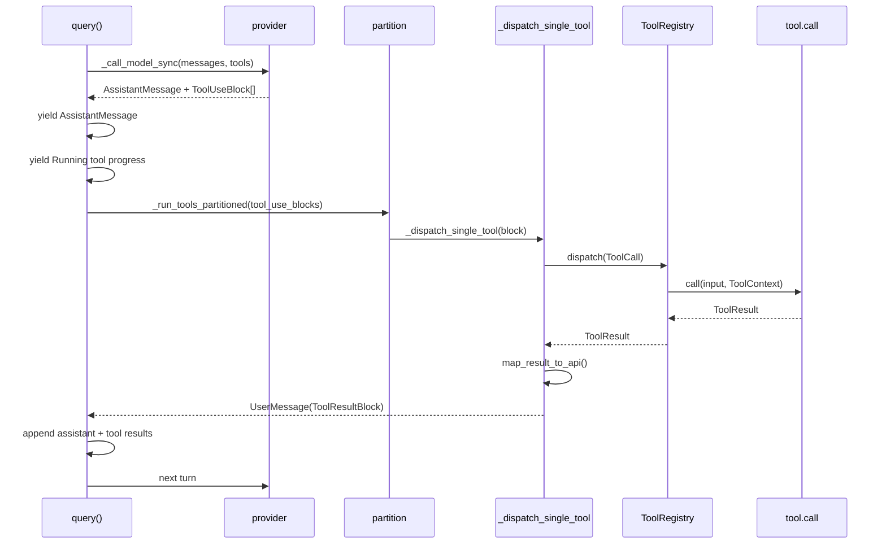

# 工具调用链解析

> [!summary]
> 当前代码里的主工具调用链是：REPL 构造 `ToolRegistry` 和 `ToolContext`，`query.py` 把工具 schema 暴露给模型；模型返回 `tool_use` 后，`query.py` 按并发安全性分批执行工具，具体执行进入 `ToolRegistry.dispatch()`，经过工具查找、schema 校验、输入校验、权限判断、人工确认、`tool.call()`，最后把 `ToolResult` 映射成 `ToolResultBlock` 写回对话，进入下一轮模型调用。

## 目录

- [[#1. 总体结论]]
- [[#2. 关键代码地图]]
- [[#3. Tool 对象模型]]
- [[#4. 工具注册链路]]
- [[#5. 工具如何暴露给模型]]
- [[#6. 模型如何发起工具调用]]
- [[#7. 主 query 工具执行链]]
- [[#8. ToolRegistry.dispatch 内部流程]]
- [[#9. 权限链路]]
- [[#10. 并发与顺序执行]]
- [[#11. ToolResult 如何回填到对话]]
- [[#12. ToolContext 的传递与状态变更]]
- [[#13. 错误、中断与最大轮数]]
- [[#14. 典型工具行为]]
- [[#15. 旁路执行器与旧链路]]
- [[#16. 重要边界与风险]]
- [[#17. 一句话模型]]

## 1. 总体结论

当前主 REPL 的工具调用主路径是：

```text
SocratesREPL.chat()
  -> QueryEngine.submit_message()
  -> query(QueryParams)
  -> _call_model_sync()
  -> 模型返回 AssistantMessage + ToolUseBlock[]
  -> _run_tools_partitioned()
  -> _dispatch_single_tool()
  -> ToolRegistry.dispatch()
  -> tool.call()
  -> ToolResult
  -> tool.map_result_to_api()
  -> ToolResultBlock
  -> UserMessage(tool_result)
  -> 追加到 messages，进入下一轮模型调用
```

核心性质：

- 工具不是模型直接执行的函数，而是先注册成 `Tool` 对象，再以 JSON schema 形式暴露给模型。
- 模型只产生 `tool_use` 请求；真正执行发生在本地 Python 进程。
- 当前主链路的权限、输入校验和工具调用都集中在 `ToolRegistry.dispatch()`。
- `query.py` 会按工具的 `is_concurrency_safe()` 动态决定并发或串行。
- 工具结果会被压成 `ToolResultBlock`，作为 `UserMessage` 回填给下一轮模型。
- `services/tool_execution/*` 提供了另一套支持 hooks、streaming、`context_modifier` 的执行器，但当前 `SocratesREPL.chat()` 主路径没有走它。

## 2. 关键代码地图

| 模块 | 作用 |
|---|---|
| `src/repl/core.py` | REPL 初始化 registry/context；`chat()` 把用户消息交给 `QueryEngine`。 |
| `src/query/engine.py` | 把 REPL 状态组装成 `QueryParams` 并调用 `query()`。 |
| `src/query/query.py` | 当前主 query loop；负责模型调用、工具分批、工具结果回填、下一轮循环。 |
| `src/tool_system/build_tool.py` | `Tool` 数据模型和 `build_tool()` 工厂。 |
| `src/tool_system/protocol.py` | `ToolCall`、`ToolResult` 协议对象。 |
| `src/tool_system/defaults.py` | 默认 registry 构建入口。 |
| `src/tool_system/tools/__init__.py` | 静态工具列表 `ALL_STATIC_TOOLS`。 |
| `src/tool_system/registry.py` | 工具注册、查找、dispatch、权限执行主入口。 |
| `src/tool_system/context.py` | `ToolContext`，承载工作目录、权限、任务、fingerprint、agent id 等运行上下文。 |
| `src/permissions/check.py` | 权限判定主逻辑。 |
| `src/permissions/handler.py` | `ask` 权限的交互确认处理。 |
| `src/services/tool_execution/*` | 旁路/备用执行器，支持 hooks、streaming 和 context modifier。 |
| `src/tool_system/agent_loop.py` | 旧式 agent loop，测试和兼容用途更明显，不是当前 REPL 主链路。 |

## 3. Tool 对象模型

工具的核心抽象是 `src/tool_system/build_tool.py::Tool`。

一个 `Tool` 主要包含：

| 字段 | 含义 |
|---|---|
| `name` | 工具名，也是模型调用时的 `tool_use.name`。 |
| `input_schema` | 暴露给模型的 JSON schema。 |
| `prompt` | 暴露给模型的工具描述。 |
| `description` | 面向 UI 或内部展示的短描述。 |
| `call` | 真正执行工具的 Python callable。 |
| `map_result_to_api` | 把工具内部输出转成 API 可接受的 `tool_result` block。 |
| `check_permissions` | 工具自定义权限检查。 |
| `validate_input` | 工具自定义输入校验。 |
| `is_enabled` | 工具是否启用。 |
| `is_concurrency_safe` | 当前输入下是否可并发执行。 |
| `is_read_only` | 当前输入下是否只读。 |
| `is_destructive` | 是否破坏性操作。 |
| `aliases` | 别名查找支持。 |
| `is_mcp` / `is_lsp` | 标记 MCP/LSP 工具。 |
| `requires_user_interaction` | 是否需要用户交互。 |
| `context_modifiers` 相关字段 | 为旁路执行器准备的上下文修改能力。 |

`build_tool()` 是统一工厂。它会把字符串形式的 `prompt` / `description` 包装成 callable，并给未指定的字段填默认值。

默认 `map_result_to_api()` 行为很朴素：

```text
dict/list -> json.dumps()
str       -> 原样返回
其他对象   -> str()
```

很多复杂工具会自己覆盖它，例如 `Read`、`Write`、`Edit`、`Bash`、`Agent`。

## 4. 工具注册链路

默认工具注册入口是：

```python
build_default_registry(provider=...)
```

注册顺序大致是：

```text
ALL_STATIC_TOOLS
  -> Agent 工具
  -> ToolSearch 工具
```

`ALL_STATIC_TOOLS` 来自 `src/tool_system/tools/__init__.py`，包含：

```text
AskUserQuestion
Bash
Brief
ClipboardRead / ClipboardWrite
Config
CronCreate / CronDelete / CronList
Edit
EnterPlanMode / ExitPlanMode
EnterWorktree / ExitWorktree
Glob
Grep
LSP
ListMcpResources / ReadMcpResource / MCP
NotebookEdit
Read
SendUserMessage
Skill
Sleep
Status
StructuredOutput
TaskCreate / TaskGet / TaskList / TaskOutput / TaskStop / TaskUpdate
TeamCreate / TeamDelete
TodoWrite
WebFetch
WebSearch
Write
```

`ToolRegistry.register()` 会：

1. 用小写工具名做索引。
2. 注册 `aliases`。
3. 防止重复注册同名工具或同名 alias。

REPL 初始化时会构造：

```text
self.tool_registry = build_default_registry(provider=self.provider)
```

然后 `chat()` 把：

```text
tools=self.tool_registry.list_tools()
tool_registry=self.tool_registry
tool_context=self.tool_context
```

交给 `QueryEngine` 和 `query()`。

## 5. 工具如何暴露给模型

模型调用发生在 `src/query/query.py::_call_model_sync()`。

它会把当前可用工具转成 provider API 需要的 schema：

```python
tool_schemas = []
for tool in tools:
    tool_schemas.append({
        "name": tool.name,
        "description": tool.prompt(),
        "input_schema": dict(tool.input_schema),
    })
```

也就是说，模型看到的是：

- 工具名。
- 工具描述。
- JSON 输入 schema。

模型看不到的是：

- `tool.call()` 的 Python 代码。
- 权限策略的完整实现。
- `ToolContext` 内部状态。
- `map_result_to_api()` 的结果映射细节。

Anthropic / Minimax provider 会把 system prompt 放到单独 `system` 参数里；其他 provider 会把 system prompt prepend 成一条 system role message。

## 6. 模型如何发起工具调用

provider 返回 `ChatResponse` 后，`_call_model_sync()` 会把响应里的工具调用转成：

```python
ToolUseBlock(
    id=tu["id"],
    name=tu["name"],
    input=tu["input"],
)
```

随后构造一条 `AssistantMessage`：

```text
AssistantMessage.content = [
  TextBlock(...),       # 如果模型同时输出了文本
  ToolUseBlock(...),    # 一个或多个工具调用
]
```

如果没有工具调用：

```text
query() yield assistant message
query() return
```

如果有工具调用：

```text
query() yield assistant message
query() yield SystemMessage("Running tool: X")
query() 执行工具
query() yield UserMessage(tool_result)
query() 追加消息后进入下一轮模型调用
```

## 7. 主 query 工具执行链

当前主执行链在 `query.py` 内部完成：



关键对象转换：

```text
ToolUseBlock
  -> ToolCall
  -> ToolResult
  -> ToolResultBlock
  -> UserMessage
```

其中：

```python
ToolCall(
    name=block.name,
    input=block.input,
    tool_use_id=block.id,
)
```

`tool_use_id` 是工具调用和工具结果之间的协议纽带。模型发出的每个 tool use 都必须得到对应的 tool result。

## 8. ToolRegistry.dispatch 内部流程

`ToolRegistry.dispatch()` 是工具执行的核心门禁。

流程如下：

```text
ToolCall
  -> 按 name/alias 查找 Tool
  -> context.ensure_tool_allowed()
  -> validate_json_schema()
  -> tool.validate_input()
  -> has_permissions_to_use_tool()
  -> 如果 ask：handle_permission_ask()
  -> tool.call(input, context)
  -> ToolResult
  -> 补 tool_use_id
```

展开看：

1. **查找工具**
   - 使用小写工具名索引。
   - 支持 alias。
   - 找不到时返回 `ToolResult(is_error=True)`，不会抛到外层。

2. **上下文级工具禁用**
   - 调用 `context.ensure_tool_allowed(tool.name)`。
   - 底层看 `permission_context.blocks(tool_name)`。
   - 子 Agent 或特殊模式可以通过这里禁用某些工具。

3. **JSON schema 校验**
   - 调用 `validate_json_schema(call.input, tool.input_schema, root_name=tool.name)`。
   - schema 失败返回错误 `ToolResult`。

4. **工具自定义输入校验**
   - 如果工具定义了 `validate_input`，继续调用。
   - 例如 `Write` 会要求覆盖已有文件前必须先 `Read`，并确认文件没被用户改过。

5. **权限判定**
   - 调用 `has_permissions_to_use_tool()`。
   - 结果可能是 `allow`、`deny`、`ask`。

6. **人工确认**
   - 如果结果是 `ask`，调用 `handle_permission_ask()`。
   - 没有 permission handler 时默认拒绝。
   - handler 允许返回 `updated_input`，例如用户确认时修改了命令或路径。

7. **真正执行**
   - 调用 `tool.call(call.input, context)`。
   - 如果工具没有自己填 `tool_use_id`，registry 会补上。

## 9. 权限链路

权限判定入口：

```text
ToolRegistry.dispatch()
  -> has_permissions_to_use_tool()
  -> has_permissions_to_use_tool_inner()
```

核心输入：

- `Tool`
- `tool_input`
- `PermissionContext`
- `ToolContext`

主要规则：

| 阶段 | 行为 |
|---|---|
| deny rules | 优先匹配，命中直接拒绝。 |
| ask rules | 命中则进入 `ask`。 |
| tool.check_permissions | 工具自定义权限逻辑。 |
| bypassPermissions / plan bypass | 如果允许 bypass，则放行。 |
| always allow rules | 命中则放行。 |
| Bash 特殊规则 | 对 command 做额外 allow/deny/ask 分类。 |
| 默认行为 | 需要 ask，或根据模式转 deny。 |

`has_permissions_to_use_tool()` 外层还有两个重要收口：

1. `permission_mode == "dontAsk"` 时，`ask` 会转成 `deny`。
2. `should_avoid_permission_prompts=True` 时，`ask` 也会转成 `deny`。

这对后台 Agent 很重要：后台模式通常不应该弹出交互式权限确认。

`handle_permission_ask()` 负责把 `ask` 变成最终结果：

```text
有 permission_handler -> 询问用户或 UI -> allow/deny/updated_input
无 permission_handler -> deny
```

## 10. 并发与顺序执行

当前主链路用 `query.py::_partition_tool_calls()` 分批。

规则是：

```text
连续的 concurrency-safe 工具 -> 同一个并发 batch
非 concurrency-safe 工具     -> 单独 exclusive batch
```

判断方式不是静态表，而是：

```python
tool.is_concurrency_safe(block.input)
```

这意味着同一个工具可以根据输入动态变化。例如 `Bash`：

- `ls`、`pwd`、`git status` 这类只读命令可能被认为可并发。
- 修改文件、启动服务、安装依赖等命令通常不可并发。

并发上限来自：

```text
SOCRATES_MAX_TOOL_USE_CONCURRENCY
```

默认值是 `10`。

实际执行时：

- 并发 batch 使用 `asyncio.to_thread()` + `asyncio.gather()`。
- exclusive batch 逐个 `asyncio.to_thread()`。
- 工具本身仍然是同步 `tool.call()` 风格，放到线程里避免堵住 async query loop。

## 11. ToolResult 如何回填到对话

工具执行返回的是内部协议对象：

```python
ToolResult(
    name="Read",
    output=...,
    is_error=False,
    tool_use_id="toolu_..."
)
```

`_dispatch_single_tool()` 会再找到对应 `Tool`，调用：

```python
tool.map_result_to_api(result.output, block.id)
```

得到 API 侧 tool result block 形态：

```json
{
  "type": "tool_result",
  "tool_use_id": "...",
  "content": "..."
}
```

随后包装成：

```python
UserMessage(
    content=[
        ToolResultBlock(
            tool_use_id=block.id,
            content=content_str,
            is_error=result.is_error,
            metadata=metadata,
        )
    ]
)
```

最后 `query()` 把消息追加进下一轮上下文：

```python
messages=[
    *messages,
    *assistant_messages,
    *tool_results,
]
```

所以模型下一轮看到的是：

```text
上一轮 assistant 的 tool_use
对应 user 的 tool_result
```

这是标准工具调用闭环。

### 11.1 metadata 的用途

如果 `result.output` 是 dict，主链路会把原始输出塞进：

```python
ToolResultBlock.metadata["tool_output"]
```

当前注释提到主要用于 REPL 渲染富预览，例如 `Edit` 的 `structuredPatch`。这份 metadata 是本地进程内 UI 辅助信息，不一定会作为普通文本发给模型。

### 11.2 new_messages / context_modifier 的当前状态

`ToolResult` 协议支持：

```python
new_messages
context_modifier
```

但当前 `query.py::_dispatch_single_tool()` 没有消费这两个字段。

真正处理它们的是 `src/services/tool_execution/tool_execution.py` 和 `orchestrator.py` 这套旁路执行器。因此在当前 REPL 主链路里：

- 工具返回 `context_modifier` 不会自动修改 `ToolContext`。
- 工具返回 `new_messages` 不会自动插入主对话。

这点对 `Skill` 等工具尤其重要，因为它的注释里已经写明“调用者必须支持 context_modifier 才会生效”。

## 12. ToolContext 的传递与状态变更

`ToolContext` 是工具执行时的运行上下文，贯穿整个工具调用链。

它承载：

| 字段 | 作用 |
|---|---|
| `workspace_root` / `cwd` | 工作区和当前目录。 |
| `permission_context` | 权限模式、allow/deny/ask 规则、路径限制。 |
| `read_file_fingerprints` | 记录已读文件内容 fingerprint，供写入/编辑前校验。 |
| `task_manager` | 后台任务管理。 |
| `mcp_clients` / `lsp_client` | MCP/LSP 客户端。 |
| `todos` / `tasks` | TODO 和 task 状态。 |
| `background_bash_tasks` | Bash 后台任务状态。 |
| `plan_mode` | 计划模式状态。 |
| `worktree_root` | worktree 上下文。 |
| `outbox` / `ask_user` | 用户消息与询问通道。 |
| `agent_id` / `agent_type` | 子 Agent 工具调用时的身份标记。 |
| `tool_use_id` | 当前执行中的工具调用 id。 |

典型状态变更：

- `Read` 成功读取文件后调用 `context.mark_file_read()`。
- `Write` / `Edit` 会检查文件是否已读、是否被用户改动，然后写入并更新 fingerprint。
- `Bash` 执行 `cd` 或包装命令后可能更新 `context.cwd`。
- `TodoWrite` 修改 `context.todos`。
- `Task*` 工具修改任务管理器或 task 状态。
- `Agent` 工具会基于父 `ToolContext` 创建子 Agent 的派生上下文。

也就是说，工具调用不是纯函数；它通常通过 `ToolContext` 读写会话内状态。

## 13. 错误、中断与最大轮数

### 13.1 工具错误

如果工具找不到、schema 失败、输入校验失败、权限拒绝，`ToolRegistry.dispatch()` 通常返回：

```python
ToolResult(is_error=True, output={...})
```

如果工具执行过程中抛异常，`_dispatch_single_tool()` 捕获后返回：

```text
ToolResultBlock(is_error=True, content="Error: ...")
```

这样可以保证模型协议完整：即使工具失败，也会给每个 `tool_use_id` 一个对应 `tool_result`。

### 13.2 模型调用错误

`_call_model_sync()` 对两类 API 错误有特殊处理：

- prompt too long
- max output tokens

prompt 太长会返回 API error assistant message；max tokens 会触发最多三次恢复策略，要求模型继续输出。

### 13.3 中断

`query()` 在模型调用后、工具执行后都会检查：

```python
params.abort_controller.signal.aborted
```

如果模型已经发出了 tool use，但中断导致工具结果缺失，`_yield_missing_tool_result_blocks()` 会为未完成 tool use 补错误结果，避免下一轮对话出现“有 tool_use 但没有 tool_result”的协议破损。

### 13.4 最大轮数

如果 `QueryParams.max_turns` 存在，工具执行完成并准备进入下一轮时会检查：

```text
next_turn_count > max_turns
```

超过后 yield 一条 `SystemMessage(subtype="max_turns_reached")` 并结束。

## 14. 典型工具行为

### 14.1 Read

`Read` 是只读工具：

- `is_read_only=True`
- `is_concurrency_safe=True`
- `get_path=file_path`

核心行为：

1. 校验路径在允许范围内。
2. 读取文件或特殊格式。
3. 标记文件 fingerprint。
4. 返回文本、PDF 内容或 `file_unchanged`。

`map_result_to_api()` 会把内部结构转成模型可读文本。

### 14.2 Write

`Write` 是破坏性工具：

- `is_destructive=True`
- `is_concurrency_safe=False`
- `strict=True`

关键约束：

- 覆盖已有文件前必须先 `Read`。
- 文件必须没有被用户在外部改过。
- Markdown 写入在 `allow_docs=False` 时通常需要 ask。

它会返回 structured patch / original file 等结构，API 输出则是更简短的成功或错误文本。

### 14.3 Edit

`Edit` 也是破坏性工具：

- 要求目标文件已读。
- 要求 fingerprint 未变化。
- 使用精确字符串替换。
- 返回结构化 diff/patch。

它通常不能并发执行，因为并发编辑同一上下文容易产生竞态。

### 14.4 Bash

`Bash` 的权限和并发都依赖命令内容。

它会：

- 对危险命令做硬编码拦截。
- 调用 bash command safety 分类。
- 根据命令判断是否只读、是否可并发。
- 支持 `run_in_background`，返回后台 task id。
- 根据执行结果更新 `context.cwd`。

`Bash` 的输出映射会组合 stdout、stderr、解释信息和退出码。

### 14.5 Agent

`Agent` 本身也是一个普通工具，只是它的 `tool.call()` 会启动嵌套 query loop。

从主工具链角度看：

```text
模型调用 Agent
  -> ToolRegistry.dispatch()
  -> Agent tool.call()
  -> run_agent()
  -> 子 query()
  -> finalize_agent_tool()
  -> ToolResult
```

主 Agent 看到的仍然只是一个 `Agent` 工具结果，而不是子 Agent 的完整内部 transcript。

## 15. 旁路执行器与旧链路

代码里还有两套容易混淆的工具执行链。

### 15.1 services/tool_execution

`src/services/tool_execution/tool_execution.py::run_tool_use()` 是更完整的异步执行器，支持：

- pre tool hooks
- post tool hooks
- hook permission decision
- progress update
- `context_modifier`
- `new_messages`
- `toolUseResult`
- 子 Agent 下隐藏内部工具结果

`src/services/tool_execution/orchestrator.py::run_tools()` 和 `streaming_executor.py::StreamingToolExecutor` 基于它提供批处理和 streaming 执行能力。

但是当前主 REPL 的 `SocratesREPL.chat()` 走的是：

```text
QueryEngine.submit_message()
  -> query.py::query()
  -> query.py::_run_tools_partitioned()
```

没有看到它直接调用 `services/tool_execution.run_tool_use()`。

因此这套执行器更像“旁路/备用/未来 streaming 链路”，不能把它的 hooks 和 context modifier 行为直接归因到当前主链路。

### 15.2 tool_system/agent_loop.py

`src/tool_system/agent_loop.py::run_agent_loop()` 是另一套循环：

```text
provider.chat()
  -> conversation.add_assistant_message()
  -> registry.dispatch()
  -> conversation.add_tool_result_message()
```

它结构更传统，也出现在测试里。但当前 REPL 主路径已经由 `src/query/query.py` 接管。

## 16. 重要边界与风险

> [!warning]
> 以下是当前代码的实际边界，不是理想设计。

1. **主链路没有消费 `ToolResult.context_modifier`**
   - 协议字段存在。
   - 旁路执行器支持。
   - `query.py::_dispatch_single_tool()` 当前没有应用它。

2. **主链路没有消费 `ToolResult.new_messages`**
   - 工具可以返回。
   - 旁路执行器会插入。
   - 当前主 query loop 不会自动追加。

3. **hooks 不是当前主链路的一部分**
   - `services/tool_execution` 支持 pre/post hooks。
   - `query.py` 的直接 dispatch 路径没有调用这些 hook。

4. **工具并发依赖工具自己正确声明**
   - 如果某个写状态的工具错误地返回 `is_concurrency_safe=True`，可能产生竞态。
   - 当前分批机制信任工具的声明。

5. **权限 ask 依赖 permission handler**
   - 没有 handler 时 ask 会变成 deny。
   - 后台/子 Agent 为避免交互，也可能把 ask 收口成 deny。

6. **`backfill_observable_input` 字段存在但主链路未明显调用**
   - `Write` 定义了该字段。
   - 当前搜索结果显示主要在 `build_tool.py` 中定义、测试默认值，并未在 `query.py` / `registry.py` 主 dispatch 中调用。

7. **工具输出给模型的是映射后的文本**
   - 内部 `ToolResult.output` 可能很结构化。
   - 模型通常看到的是 `map_result_to_api()` 之后的字符串。
   - 原始 dict 只作为 `metadata.tool_output` 保留给本地 UI。

8. **工具调用失败仍需回填 tool_result**
   - 当前代码会尽量保证这一点。
   - 这是保持 provider 工具协议完整的关键。

## 17. 一句话模型

当前工具调用链可以理解为：

> 模型只负责提出结构化 `tool_use` 请求；本地 `query.py` 负责按并发安全性调度，`ToolRegistry` 负责校验和权限门禁，具体 `Tool` 负责执行，最后结果被映射成 `tool_result` 回填给模型，形成一轮“模型决策 -> 本地执行 -> 结果反馈 -> 模型继续”的闭环。

