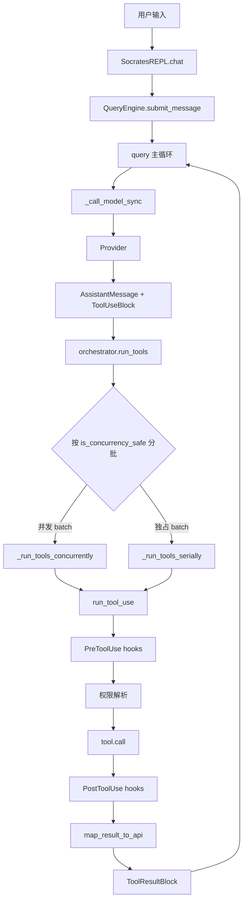
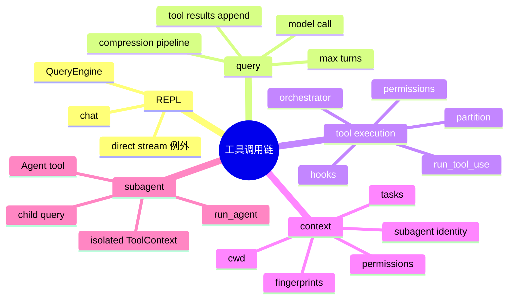

# 工具调用链
> [!summary] 当前结论
> 当前主链路是 `SocratesREPL.chat()` → `QueryEngine.submit_message()` → `query()` → `_call_model_sync()` → `orchestrator.run_tools()` → `run_tool_use()` → `tool.call()` → `ToolResultBlock` → 下一轮 `query()`。旧 `src/tool_system/agent_loop.py` 已删除；`ToolRegistry.dispatch()` 不再是 REPL 主循环的工具执行入口，主要保留为 registry 层能力与部分直接分发场景。
## 目录
- [[#1. 一句话模型]]
- [[#2. 当前主链路总览]]
- [[#3. 关键文件地图]]
- [[#4. 数据结构]]
- [[#5. 从用户输入到 QueryParams]]
- [[#6. 工具如何暴露给模型]]
- [[#7. 模型返回 tool_use 后发生什么]]
- [[#8. 工具调度 orchestrator]]
- [[#9. 单工具执行 run_tool_use]]
- [[#10. Hooks 与权限]]
- [[#11. 结果回填]]
- [[#12. ToolContext 状态]]
- [[#13. 子 Agent 链路]]
- [[#14. StreamingToolExecutor 的定位]]
- [[#15. ToolRegistry.dispatch 的定位]]
- [[#16. 错误、中断与轮数]]
- [[#17. 当前风险点]]
## 1. 一句话模型
模型只负责产生结构化 `tool_use` 请求；本地 Python 进程负责查找工具、校验输入、执行 hooks、解析权限、调用 `tool.call()`，再把结果包装成 `ToolResultBlock` 作为 `UserMessage(tool_result)` 回填给下一轮模型。
## 2. 当前主链路总览
```text
SocratesREPL.chat()
  -> QueryEngine.submit_message()
  -> query(QueryParams)
  -> _call_model_sync()
  -> provider.chat_stream_response()/provider.chat()
  -> AssistantMessage + ToolUseBlock[]
  -> services.tool_execution.orchestrator.run_tools()
  -> partition_tool_calls()
  -> _run_tools_concurrently() 或 _run_tools_serially()
  -> tool_execution.run_tool_use()
  -> validate_input
  -> PreToolUse hooks
  -> permission resolution
  -> tool.call(input, ToolContext)
  -> PostToolUse hooks / PostToolUseFailure hooks
  -> tool.map_result_to_api()
  -> ToolResultBlock
  -> UserMessage(tool_result)
  -> query() 追加结果并进入下一轮模型调用
```

> [!note] direct stream 例外
> `SocratesREPL.chat()` 对简单无工具提示可能先走 direct stream，只做纯文本流式回复；一旦需要工具、direct stream 不适用或失败，就回到 `QueryEngine` 主链路。
## 3. 关键文件地图
| 文件 | 角色 |
|---|---|
| `src/repl/core.py` | REPL 入口；构造 provider、registry、`ToolContext`；渲染 assistant/tool/result。 |
| `src/query/engine.py` | 把 REPL 状态转成 `QueryParams`；维护 `_mutable_messages`。 |
| `src/query/query.py` | 主 query loop；模型调用、压缩管线、工具执行、结果回填、下一轮循环。 |
| `src/services/tool_execution/orchestrator.py` | 按并发安全性分批；串行/并发执行工具；应用 `context_modifier`。 |
| `src/services/tool_execution/tool_execution.py` | 单工具执行核心；查找工具、校验、hooks、权限、调用、映射结果。 |
| `src/services/tool_execution/tool_hooks.py` | `PreToolUse`、`PostToolUse`、`PostToolUseFailure` 与 hook 权限决策。 |
| `src/services/tool_execution/streaming_executor.py` | 边流式边执行工具的执行器；当前主 `query()` 未直接使用。 |
| `src/tool_system/build_tool.py` | `Tool` 数据模型与 `build_tool()` 工厂。 |
| `src/tool_system/context.py` | `ToolContext` 与 `ToolUseOptions`。 |
| `src/tool_system/registry.py` | 工具注册、查找、过滤、合并、直接 dispatch 能力。 |
| `src/tool_system/defaults.py` | 默认 registry 构建。 |
| `src/tool_system/tools/*` | 内置工具实现。 |
| `src/tool_system/tool_summaries.py` | REPL 渲染工具调用标题的摘要辅助。 |
| `src/agent/run_agent.py` | 子 Agent 的 query loop 包装。 |
| `src/agent/subagent_context.py` | 子 Agent 上下文隔离。 |
## 4. 数据结构
### 4.1 `Tool`
| 字段 | 作用 |
|---|---|
| `name` | 模型调用时的工具名。 |
| `input_schema` | 暴露给模型的 JSON schema。 |
| `prompt()` | 暴露给模型的工具描述。 |
| `call(input, context)` | 真正执行工具的 Python callable。 |
| `map_result_to_api(output, tool_use_id)` | 把内部输出转成 provider tool result block。 |
| `validate_input(input, context)` | 工具级输入校验。 |
| `check_permissions(input, context)` | 工具级权限判断入口之一。 |
| `is_concurrency_safe(input)` | 当前输入是否可并发。 |
| `is_read_only(input)` | 当前输入是否只读。 |
| `is_destructive(input)` | 当前输入是否破坏性操作。 |
| `is_mcp` / `is_lsp` | 标记外部协议工具。 |
| `requires_user_interaction()` | 是否必须经用户交互。 |
### 4.2 `ToolUseBlock`
模型返回的工具请求：
```python
ToolUseBlock(id="toolu_...", name="Read", input={"file_path": "README.md"})
```
### 4.3 `ToolResult`
工具内部执行结果：
```python
ToolResult(name="Read", output=..., is_error=False, tool_use_id="toolu_...")
```
### 4.4 `ToolResultBlock`
回填给模型的协议结果：
```python
ToolResultBlock(tool_use_id="toolu_...", content="...", is_error=False, metadata={...})
```
### 4.5 `ToolContext`
工具运行上下文，保存工作目录、权限、已读文件 fingerprint、MCP/LSP 客户端、TODO、任务、后台 Bash、Agent 身份和中断控制器。
## 5. 从用户输入到 QueryParams
`SocratesREPL.chat()` 的关键动作：
1. 展开 `@path` 和 `@agent` mention。
2. 记录用户输入到会话。
3. 如 direct stream 不适用，构造 `QueryEngineConfig`。
4. `tools = self.tool_registry.list_tools()`。
5. 把 `provider`、`tool_registry`、`tools`、`tool_context`、`initial_messages` 传给 `QueryEngine`。
`QueryEngine.submit_message()` 的关键动作：
1. 创建 `UserMessage(content=prompt)` 并追加到 `_mutable_messages`。
2. 构建 system prompt、user context、system context。
3. 把 CLAUDE.md/date 等 user context prepend 进消息。
4. 创建 `PipelineConfig`，携带 read file state。
5. 构造 `QueryParams` 并 `async for message in query(params)`。
> [!important] `tool_registry` 与 `tools`
> `QueryParams` 同时携带 `tool_registry` 和 `tools`，但当前主执行路径主要通过 `tool_use_context.options.tools = params.tools` 后用 `find_tool_by_name()` 查找工具；不是通过 `ToolRegistry.dispatch()` 执行。
## 6. 工具如何暴露给模型
`_call_model_sync()` 会把 `Tools` 转成 provider schema：
```python
tool_schemas.append({
    "name": tool.name,
    "description": tool.prompt(),
    "input_schema": dict(tool.input_schema),
})
```
模型能看到：
- 工具名。
- 工具描述。
- 输入 schema。
模型看不到：
- `tool.call()` 实现。
- 权限策略内部细节。
- `ToolContext` 状态。
- hooks 配置和执行结果映射逻辑。
Provider 分支：
| Provider | system prompt 位置 |
|---|---|
| Anthropic / Minimax | `call_kwargs["system"]` |
| 其他 OpenAI-like | prepend 为 `{"role": "system"}` |
模型调用优先 `provider.chat_stream_response()`，不支持时 fallback 到 `provider.chat()`。
## 7. 模型返回 tool_use 后发生什么
`_call_model_sync()` 把 provider `ChatResponse` 转成：
```text
response.content -> TextBlock
response.tool_uses[] -> ToolUseBlock[]
TextBlock + ToolUseBlock[] -> AssistantMessage
```
`query()` 决策：
| 情况 | 行为 |
|---|---|
| 无 `tool_use` | yield assistant message 后结束。 |
| 有 `tool_use` | yield assistant message；yield `SystemMessage(subtype="tool_use_progress")`；调用 `run_tool_execution_service()`。 |
工具执行完成后，`query()` 只筛选真正含 `ToolResultBlock` 的 `UserMessage` 作为下一轮上下文：
```python
tool_results = [
    msg for msg in tool_execution_messages
    if isinstance(msg, UserMessage) and _has_tool_result_content(msg)
]
```
下一轮状态：
```python
messages = [*messages, *assistant_messages, *tool_results]
```
## 8. 工具调度 orchestrator
### 8.1 分批规则
`partition_tool_calls()` 逐个扫描 `ToolUseBlock`：
```text
concurrency-safe 且上一批也是 concurrency-safe -> 合并到上一批
否则 -> 新建 batch
```
判断来自：
```python
tool.is_concurrency_safe(tool_use.input)
```
> [!tip] 顺序语义
> 分批不会全局重排工具，只合并“连续的”并发安全工具，因此模型返回顺序仍然是执行边界。
### 8.2 并发 batch
`_run_tools_concurrently()`：
- 默认最大并发来自 `CLAUDE_CODE_MAX_TOOL_USE_CONCURRENCY`，默认 `10`。
- 每个工具用 task 跑 `run_tool_use()`。
- 结果进入 queue 后由 orchestrator yield。
- `context_modifier` 先排队，batch 结束后按 block 顺序应用。
### 8.3 串行 batch
`_run_tools_serially()`：
- 逐个设置 `in_progress_tool_use_ids`。
- 为当前 `tool_use` 找 assistant message。
- 调 `run_tool_use()`。
- 有 `context_modifier` 时立即应用。
- 工具完成后 `_mark_tool_use_as_complete()`。
## 9. 单工具执行 run_tool_use
`run_tool_use()` 是当前主链路的单工具核心：
```text
ToolUseBlock
  -> find_tool_by_name(context.options.tools, name)
  -> input dict 规范化
  -> abort 检查
  -> validate_input
  -> PreToolUse hooks
  -> resolve permission
  -> tool.call()
  -> PostToolUse hooks
  -> map_result_to_api
  -> UserMessage(ToolResultBlock)
```
找不到工具时返回 error tool result，不抛出到主循环：
```text
<tool_use_error>Error: No such tool available: X</tool_use_error>
```
工具调用前会写入：
```python
call_context.tool_use_id = tool_use_id
call_context.user_modified = permission_decision.get("userModified", False)
```
`_call_tool()` 兼容同步和 async callable；如果返回值不是 `ToolResult`，会包装成 `ToolResult`。
## 10. Hooks 与权限
### 10.1 PreToolUse
`run_pre_tool_use_hooks()` 可产出：
| 类型 | 影响 |
|---|---|
| `message` | 插入 hook 消息。 |
| `hookPermissionResult` | 提供 `allow` / `ask` / `deny`。 |
| `hookUpdatedInput` | 修改工具输入。 |
| `additionalContext` | 追加上下文 attachment。 |
| `preventContinuation` | 工具执行后阻止继续。 |
| `stopReason` | 记录停止原因。 |
| `stop` | 直接返回取消 tool result。 |
### 10.2 权限解析
入口是 `resolve_hook_permission_decision()`：
```text
hook result 为空 -> _resolve_tool_permission()
hook allow -> 仍检查 rule-based deny/ask，必要时调用 can_use_tool
hook ask -> 传给 can_use_tool
hook deny -> 直接 deny
```
> [!warning] hook allow 不等于绕过规则
> 文件头注释明确说明：hook `allow` 不绕过 settings deny/ask rules。当前实现会在 hook allow 后继续走 `check_rule_based_permissions()`。
当前 `query()` 调用 orchestrator 时传入的 `can_use_tool` 是 `None`，因此一般会落到默认权限逻辑：
```text
has_permissions_to_use_tool()
  -> handle_permission_ask() 仅在 context.permission_handler 存在时可交互
  -> 无 handler 时 ask 通常收口为 deny
```
### 10.3 PostToolUse
`run_post_tool_use_hooks()` 可产出：
- blocking error attachment。
- stopped continuation attachment。
- additional context。
- MCP 输出更新：`updatedMCPToolOutput`。
- 普通 message。
### 10.4 PostToolUseFailure
工具执行抛错时会调用 `run_post_tool_use_failure_hooks()`，用于失败后的 attachment、上下文或消息补充。
## 11. 结果回填
成功路径：
```text
tool.call()
  -> ToolResult.data
  -> post hooks 可能修改 tool_response_data
  -> tool.map_result_to_api(tool_response_data, tool_use_id)
  -> _map_tool_result_to_block()
  -> create_user_message(content=[ToolResultBlock])
```
`_map_tool_result_to_block()` 行为：
| 输入 | 输出 |
|---|---|
| `api_block["content"]` 非字符串 | `json.dumps(..., ensure_ascii=False)` |
| `raw_output` 是 dict | 写入 `metadata["tool_output"]` |
| `api_block["is_error"]` | 转成 `ToolResultBlock.is_error` |
> [!note] UI 与模型看到的内容
> 模型主要看到 `ToolResultBlock.content`；本地 REPL 可用 `metadata.tool_output` 渲染更丰富的工具预览，例如 patch/diff。
## 12. ToolContext 状态
`ToolContext` 是本地执行状态总线：
| 字段 | 用途 |
|---|---|
| `workspace_root` / `cwd` | 路径解析与命令执行目录。 |
| `permission_context` | 权限模式和规则。 |
| `read_file_fingerprints` | Read/Write/Edit 防陈旧状态。 |
| `task_manager` / `tasks` | 任务工具状态。 |
| `background_bash_tasks` | 后台 Bash 状态。 |
| `mcp_clients` / `lsp_client` | 外部工具客户端。 |
| `plan_mode` / `worktree_root` | 模式和 worktree 状态。 |
| `outbox` / `ask_user` | 向用户发消息或提问。 |
| `options.tools` | 当前可用工具池。 |
| `abort_controller` | 中断传播。 |
| `agent_id` / `agent_type` | 子 Agent 身份。 |
典型副作用：
- `Read` 标记文件 fingerprint。
- `Write` / `Edit` 校验文件已读且未变，再修改文件。
- `Bash` 可更新 `cwd` 或登记后台任务。
- `Task*` 更新任务状态。
- `Agent` 创建隔离子上下文并运行嵌套 `query()`。
## 13. 子 Agent 链路
`Agent` 是普通工具，但它的 `tool.call()` 会启动子 query loop：
```text
Parent query()
  -> Agent ToolUseBlock
  -> run_tool_use(Agent)
  -> make_agent_tool._agent_call()
  -> RunAgentParams
  -> run_agent()
  -> create_subagent_context()
  -> child query(QueryParams)
  -> finalize_agent_tool()
  -> ToolResult(status="completed" / "async_launched")
  -> parent ToolResultBlock
```
### 13.1 子上下文隔离
`create_subagent_context()` 默认隔离：
- `read_file_fingerprints` 为空，避免子 Agent 误以为已读父 Agent 读过的文件。
- `tasks`、`outbox`、`crons` 新建。
- `permission_handler` 默认不共享。
- `set_in_progress_tool_use_ids` 默认不共享。
- abort controller 可共享或创建 child controller。
### 13.2 权限继承
`resolve_permission_mode()` 规则：
| 父模式 | 子 Agent 行为 |
|---|---|
| `bypassPermissions` / `acceptEdits` / `dontAsk` | 父模式优先。 |
| `plan` / `default` | Agent definition 可覆盖。 |
| async agent | `should_avoid_permission_prompts=True`。 |
### 13.3 同步与后台
| 模式 | 行为 |
|---|---|
| 同步 Agent | 父工具调用等待子 Agent 完成，返回最终内容。 |
| 后台 Agent | 立即返回 `async_launched`，后台生命周期异步收集消息。 |
## 14. StreamingToolExecutor 的定位
`StreamingToolExecutor` 支持“模型边流式吐出工具，工具边开始执行”：
- 维护 `queued` / `executing` / `completed` / `yielded` 状态。
- 并发安全工具可同时执行。
- 非并发工具独占执行。
- progress message 可提前 yield。
- Bash 并发错误会触发 sibling abort。
- 每个工具有 child abort controller。
> [!info] 当前使用情况
> 当前 `query()` 主链路没有直接实例化 `StreamingToolExecutor`；主链路使用 `orchestrator.run_tools()` 批处理模型完整返回的 `ToolUseBlock[]`。
## 15. ToolRegistry.dispatch 的定位
`ToolRegistry` 仍然重要：
- 注册工具。
- 按名称/alias 查找工具。
- `list_tools()` 给 REPL 和 QueryEngine 提供工具池。
- `assemble_tool_pool()` / `get_tools()` 做权限过滤与 MCP 合并。
- `dispatch()` 仍可用于直接分发测试或非主循环调用。
但当前 REPL 主执行链不是：
```text
ToolRegistry.dispatch() -> tool.call()
```
而是：
```text
run_tool_use() -> find_tool_by_name(context.options.tools) -> tool.call()
```
> [!warning] 不要再把 `ToolRegistry.dispatch()` 写成主工具链核心
> 它曾经承担旧 agent loop 的执行入口，但旧 `src/tool_system/agent_loop.py` 已删除；现在 hooks、权限解析和 context modifier 都在 `services/tool_execution` 链路里。
## 16. 错误、中断与轮数
### 16.1 模型错误
`_call_model_sync()` 特殊处理：
- prompt too long → API error assistant message。
- max output tokens → 首次提升到 `ESCALATED_MAX_TOKENS = 64000`，之后最多恢复 3 次。
### 16.2 工具错误
工具错误会尽量转成对应 `tool_use_id` 的 error `ToolResultBlock`：
```text
ToolUseBlock(id="x") -> UserMessage(ToolResultBlock(tool_use_id="x", is_error=True))
```
这样可保持 provider 工具协议完整。
### 16.3 中断
`query()` 在模型调用后和工具执行后检查 `abort_controller.signal.aborted`；若 assistant 已经产生 tool use 但结果缺失，会用 `_yield_missing_tool_result_blocks()` 补错误结果。
### 16.4 最大轮数
工具执行完成后：
```python
next_turn_count = turn_count + 1
if params.max_turns and next_turn_count > params.max_turns:
    yield SystemMessage(subtype="max_turns_reached")
```
子 Agent 默认最大轮数是 `SUBAGENT_DEFAULT_MAX_TURNS = 30`，除非 Agent definition 或参数覆盖。
## 17. 当前风险点
> [!warning] 维护时重点看这里
> 这些不是 bug 结论，而是当前设计里最容易误读或出问题的边界。
- **`can_use_tool` 当前为 `None`**：主 `query()` 调 orchestrator 时未传交互式 callback，权限 `ask` 的用户交互依赖 `ToolContext.permission_handler` 等默认路径。
- **并发安全完全信任工具声明**：`is_concurrency_safe(input)` 判断错误会带来竞态。
- **并发 batch 的 context modifier 延迟应用**：这能避免并发中互相修改 context，但也意味着同一 batch 内后续工具看不到前面工具的 context modifier。
- **Post hook 可修改 MCP 输出但普通工具输出修改能力有限**：当前 `updatedMCPToolOutput` 只在 `tool.is_mcp` 时应用。
- **StreamingToolExecutor 与 orchestrator 是两套调度模型**：修改执行语义时要确认改的是当前主链路。
- **文档和测试容易残留旧 agent_loop 心智模型**：旧文件已删，看到 `run_agent_loop` 应视为过期引用。
## 附：最小心智图

